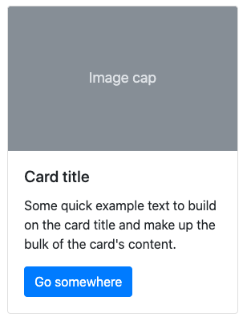

# Cards

<div class="row">
<div class="cell-3">

```
<div class="card" style="width: 18rem;">
  
  <div class="card-body">
    <h5 class="card-title">Card title</h5>
    <p class="card-text">Some quick...</p>
    <a href="#" class="btn btn-primary">Go somewhere</a>
  </div>
</div>

```

</div>
<div class="cell-3">



</div>
</div>