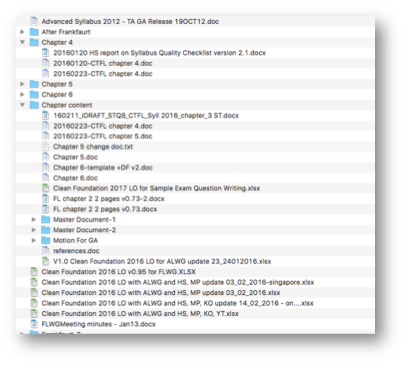

# Version Control

* What is wrong with this style of versioning?
* Which file is the original?
* Can you find the latest version of the document?
* Solution: Version control
* An automated way to keep track of changes and different version of your code/documents

