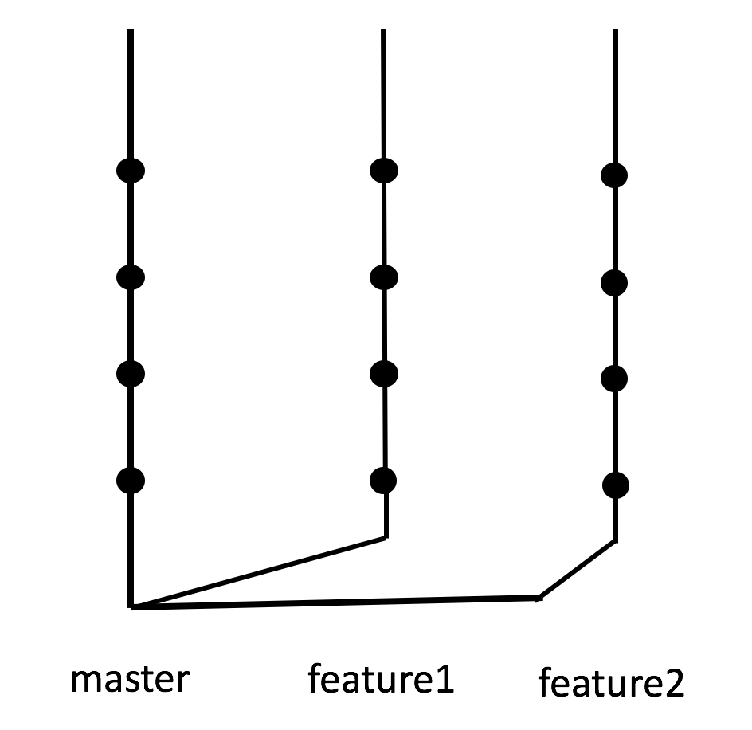

# Branching out

* Applications get split over hundreds of files and as developers, we'll often work on very different features in tandem
* We create a branch so we can easily revert back to different states depending on a feature being worked on -- because it can be hard to identify bugs if you're changing too much logic at one time

