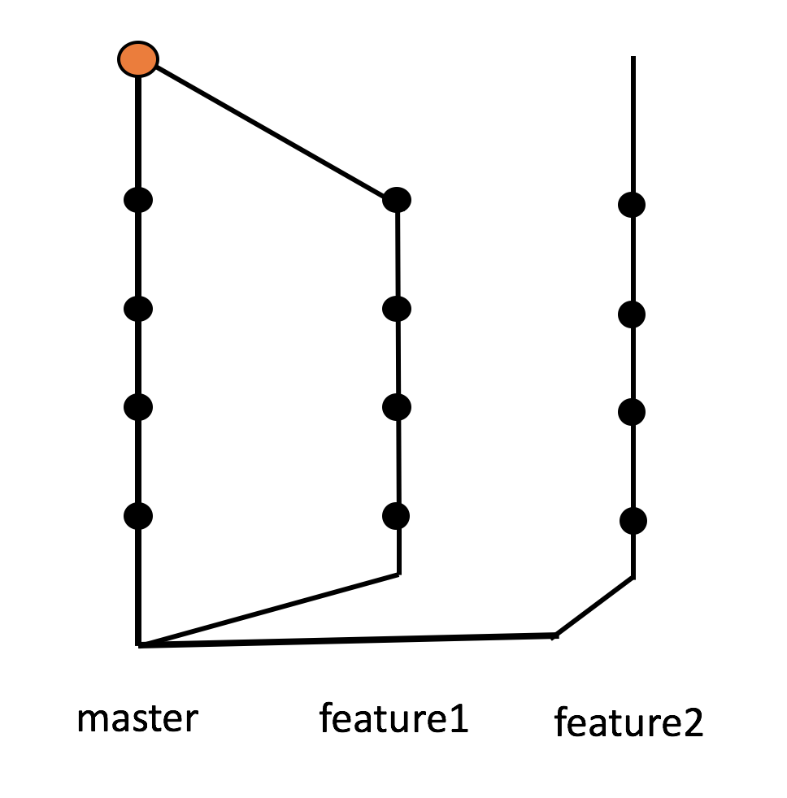
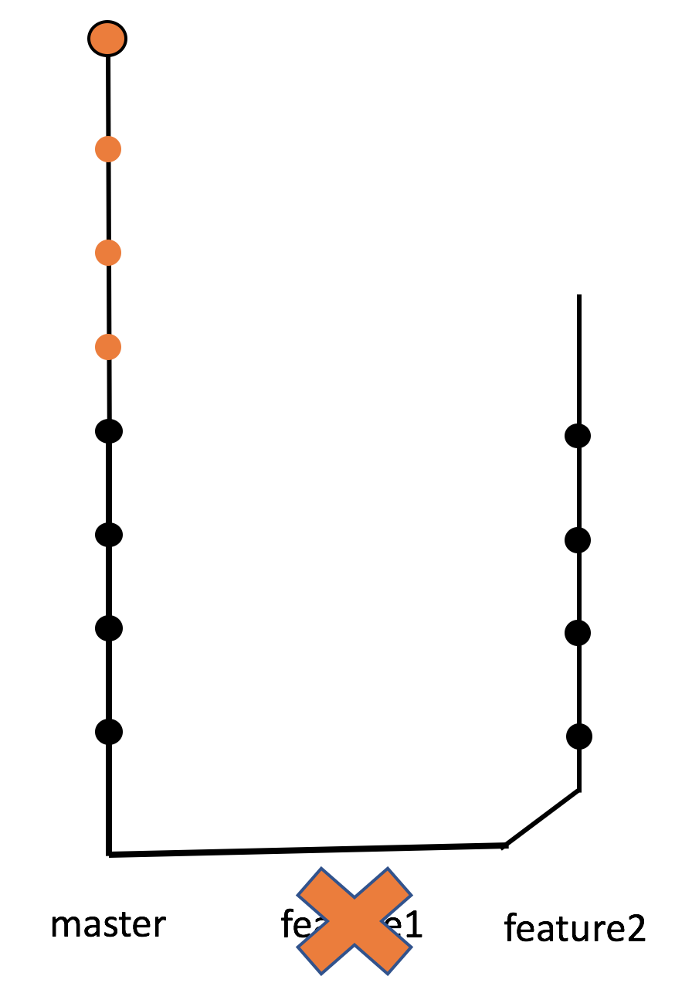

# Branching out

* Branches eventually get **merged** back into the **master** branch once the feature development and testing has completed
* Once merged, you typically delete the old branch as all its commits have been incorporated into the master. {.fragment}

{.fragment .fragment-dn data-style=out}
{.fragment .fragment-dn}

