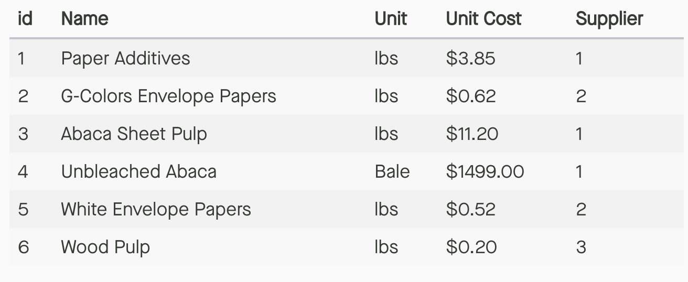

# Time to Normalize: decompose items

* Extract the relevant fields for items and place them in their own table
* Add a column to apply a **relationship** of the item to a supplier

### *items table* {style=margin-top:25px}

* items.supplier_id column must be a valid suppliers.id

* a column in one table that **references** the primary key of another is called a **foreign key**

* a single supplier may be related to many items - aka one-to-many relationship

