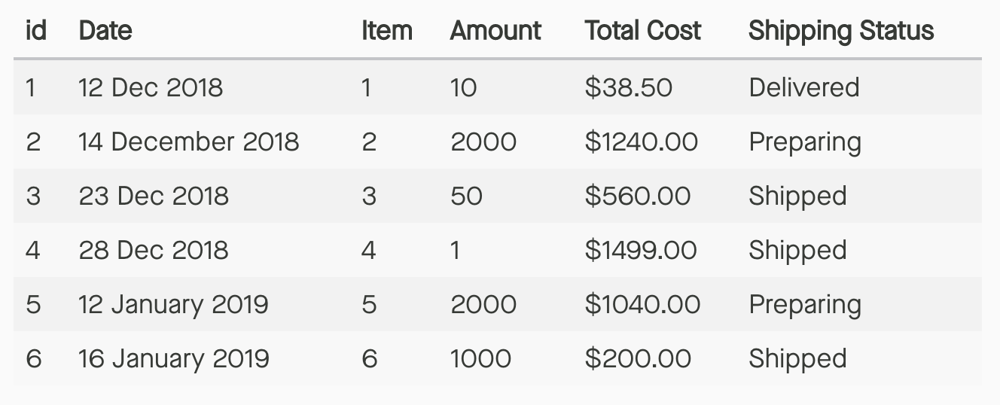

# Time to Normalize: decompose orders

* Extract the relevant fields for orders and place in their own table
* Add a column to apply a **relationship** of the order to an item

### *supplier_order table* {.center}

