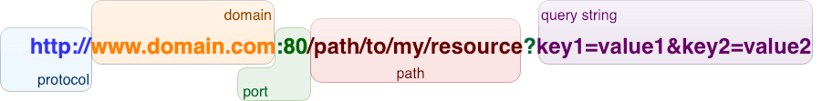

# Uniform Resource Locator

{.center}

* URL is the syntax used by a client requesting from a server
* Protocol + domain + port indicate the **machine** being contacted
* Path is the **service** or **function** being called
  * Warning! Path is very often NOT a path to a file location
* Querystring composes the **parameters** being sent to the function