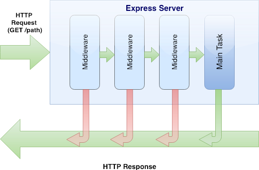

# Middleware

* When a server receives a request, it may execute many functions (in milliseconds!) before sending the response
* Each function has its own responsibility, usually to modify the request or response in some way
* Middleware could be handling authentication, logging, security, content parsing, and many other tasks

{.center style="width:700px;"}