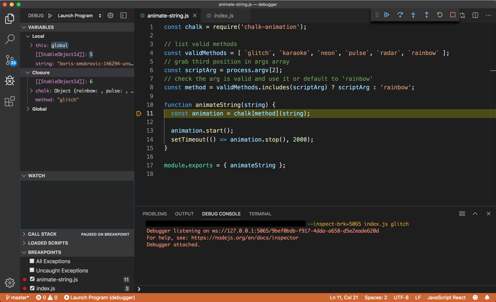

# NDB Walkthrough

{.center}

* Run script
* Add breakpoint
* Step
* Examine vars
* Real time REPL
* Use CL arguments

* [Live demo assignment](https://courses.thinkful.com/ei-node-postgres-v1/checkpoint/2){target="_blank"}

